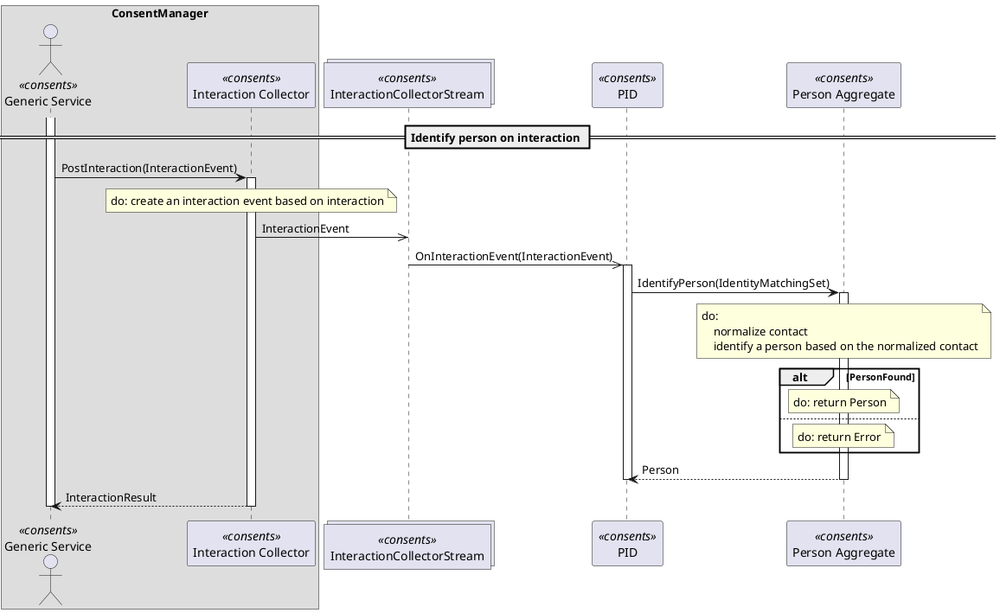

TUC console
===========

[](https://dev.azure.com/MortalFlesh/TucConsole/_build/latest?definitionId=1)
[](https://travis-ci.com/MortalFlesh/tuc-console)

> Console application for .tuc commands.

## Motivation
We have a DDD based micro service architecture, where most of the services have an asynchronous communication between them (mostly through event streams) with a domain specific ubiquitous language.

And we need to document the use-cases done by those services.

For now, we use a [PlantUML](https://plantuml.com/) directly, but it is **a lot** of work, so we decided to create a *language* to help us with that - **TUC**.

## TUC
> **T**yped **U**se-**C**ase

It is basically a use case definition, for which this console application can generate [PlantUML](https://plantuml.com/) diagram, where all services are domain specific type safe.

## Example

The process of this use-case is a collecting interactions by the users.

User interacts with the GenericService, which sends an interaction to the interaction collector service.
Interaction collector service identify a person and accepts an interaction.

*It is just a simplified real-life process.*

*Note: All files are in the [example](https://github.com/MortalFlesh/tuc-console/tree/master/example) dir.*

### domain.fsx
```fs
// Common types

type Id = UUID

type Stream<'Event> = Stream of 'Event list
type StreamHandler<'Event> = StreamHandler of ('Event -> unit)

// Types

type InteractionEvent =
    | Confirmation
    | Rejection

type InteractionResult =
    | Accepted
    | Error

type IdentityMatchingSet = {
    Contact: Contact
}

and Contact = {
    Email: Email option
    Phone: Phone option
}

and Email = Email of string
and Phone = Phone of string

type Person =
    | Known of PersonId
    | Unknown

and PersonId = PersonId of Id

// Streams

type InteractionCollectorStream = Stream<InteractionEvent>

// Services

type GenericService = Initiator

type InteractionCollector = {
    PostInteraction: InteractionEvent -> InteractionResult
}

type PersonIdentificationEngine = {
    OnInteractionEvent: InteractionEvent -> unit
}

type PersonAggregate = {
    IdentifyPerson: IdentityMatchingSet -> Person
}
```

### definition.tuc
```tuc
tuc Identify person on interaction
participants
  ConsentManager
    GenericService consents as "Generic Service"
    InteractionCollector consents as "Interaction Collector"
  [InteractionCollectorStream] consents
  PersonIdentificationEngine consents as "PID"
  PersonAggregate consents as "Person Aggregate"

GenericService
  InteractionCollector.PostInteraction
    do create an interaction event based on interaction
    InteractionEvent -> [InteractionCollectorStream]

    [InteractionCollectorStream]
      PersonIdentificationEngine.OnInteractionEvent
        PersonAggregate.IdentifyPerson
          do
            normalize contact
            identify a person based on the normalized contact

          if PersonFound
            do return Person
          else
            do return Error
```

Console app will generate following `result.puml` based on the Domain types (from `domain.fsx`) and the `definition.tuc` file, where the use-case is.

For example there is a
```tuc
GenericService
  InteractionCollector.PostInteraction
```
call in the `definition.tuc` file.
It will find an `InteractionCollector` type and its `PostInteraction` method signature
```fs
type InteractionCollector = {
    PostInteraction: InteractionEvent -> InteractionResult
}
```
and generate
```puml
GenericService -> InteractionCollector : PostInteraction(InteractionEvent)
activate InteractionCollector

InteractionCollector --> GenericService: InteractionResult
deactivate InteractionCollector
```
out of it.

### result.puml



## Run statically

First compile
```sh
fake build target release
```

Then run
```sh
dist/<architecture>/TucConsole help
```

List commands
```sh
dist/<architecture>/TucConsole list
```
     ______  __  __  _____       _____                        __
    /_  __/ / / / / / ___/      / ___/ ___   ___   ___ ___   / / ___
     / /   / /_/ / / /__       / /__  / _ \ / _ \ (_-</ _ \ / / / -_)
    /_/    \____/  \___/       \___/  \___//_//_//___/\___//_/  \__/

    ==================================================================

    Usage:
        command [options] [--] [arguments]

    Options:
        -h, --help            Display this help message
        -q, --quiet           Do not output any message
        -V, --version         Display this application version
        -n, --no-interaction  Do not ask any interactive question
        -v|vv|vvv, --verbose  Increase the verbosity of messages

    Available commands:
        about         Displays information about the current project.
        help          Displays help for a command
        list          Lists commands
    domain
        domain:check  Checks given domains.
    tuc
        tuc:check     Checks given tuc.
        tuc:generate  Compile a tuc with domain types and generates a use-case in the PlantUML format out of it.

---
### Development

First run:
```
paket install
fake build
```

or `fake build target watch`

List commands
```sh
bin/console list
```

Run tests locally
```sh
fake build target Tests
```
