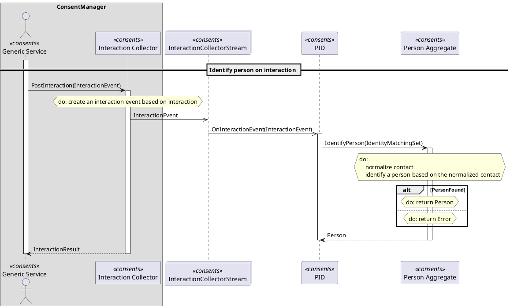

Tuc - Example
=============

[Home](/tuc-console/) / [Tuc](/tuc-console/tuc/) / Example

---

The process of this use-case is a collecting interactions by the users.

User interacts with the GenericService, which sends an interaction to the interaction collector service.
Interaction collector service identify a person and accepts an interaction.

*It is just a simplified real-life process.*

**Note**: All files are in the [example](https://github.com/MortalFlesh/tuc-console/tree/master/example) dir.

## domain.fsx
```fs
// Common types

type Id = UUID

type Stream<'Event> = Stream of 'Event list
type StreamHandler<'Event> = StreamHandler of ('Event -> unit)

// Types

type InteractionEvent =
    | Confirmation
    | Rejection

type InteractionResult =
    | Accepted
    | Error

type IdentityMatchingSet = {
    Contact: Contact
}

and Contact = {
    Email: Email option
    Phone: Phone option
}

and Email = Email of string
and Phone = Phone of string

type Person =
    | Known of PersonId
    | Unknown

and PersonId = PersonId of Id

// Streams

type InteractionCollectorStream = Stream<InteractionEvent>

// Services

type GenericService = Initiator

type InteractionCollector = {
    PostInteraction: InteractionEvent -> InteractionResult
}

type PersonIdentificationEngine = {
    OnInteractionEvent: InteractionEvent -> unit
}

type PersonAggregate = {
    IdentifyPerson: IdentityMatchingSet -> Person
}
```

## definition.tuc
```tuc
tuc Identify person on interaction
participants
  ConsentManager
    GenericService consents as "Generic Service"
    InteractionCollector consents as "Interaction Collector"
  [InteractionCollectorStream] consents
  PersonIdentificationEngine consents as "PID"
  PersonAggregate consents as "Person Aggregate"

GenericService
  InteractionCollector.PostInteraction
    do create an interaction event based on interaction
    InteractionEvent -> [InteractionCollectorStream]

    [InteractionCollectorStream]
      PersonIdentificationEngine.OnInteractionEvent
        PersonAggregate.IdentifyPerson
          do
            normalize contact
            identify a person based on the normalized contact

          if PersonFound
            do return Person
          else
            do return Error
```

Console app will generate following `result.puml` based on the Domain types (from `domain.fsx`) and the `definition.tuc` file, where the use-case is.

For example there is a
```tuc
GenericService
  InteractionCollector.PostInteraction
```
call in the `definition.tuc` file.
It will find an `InteractionCollector` type and its `PostInteraction` method signature
```fs
type InteractionCollector = {
    PostInteraction: InteractionEvent -> InteractionResult
}
```
and generate
```puml
GenericService -> InteractionCollector : PostInteraction(InteractionEvent)
activate InteractionCollector

InteractionCollector --> GenericService: InteractionResult
deactivate InteractionCollector
```
out of it.

## result.puml



