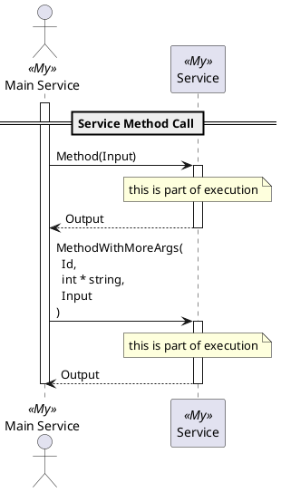
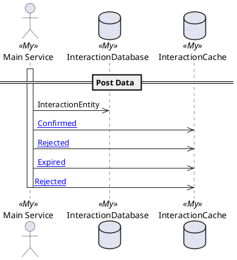
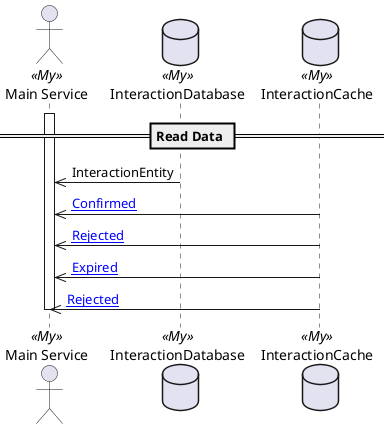
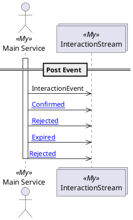
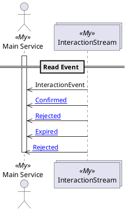

Tuc Parts
=========

[Home](/tuc-console/) / [Tuc](/tuc-console/tuc/) / Parts

---

There **must** be at lease one part of the use-case in the Tuc definition.

## Use-Case Parts
- [Lifeline](#lifeline)
- [Section](#section)
- [Service Method Call](#service-method-call)
- [Post Data](#post-data)
- [Read Data](#read-data)
- [Post Event](#post-event)
- [Read Event](#read-event)
- [Handle Event In Stream](#handle-event-in-stream)
- [Group](#group)
- [If](#if)
- [Loop](#loop)
- [Do](#do)
- [Left Note](#left-note)
- [Note](#note)
- [Right Note](#right-note)

---

## Lifeline
> Life line is the execution of the [**Initiator**](/tuc-console/domain/#initiator).

* It **may** contain other use-case parts, indented by one level.
* It _activates_ an Initiator and _deactivates_ it, in the end of a lifeline.

### Syntax
```tuc
{InitiatorService}
    // indented execution of the lifeline
```

### Example
```fs
// myDomain.fsx

type MainService = Initiator
```

```tuc
tuc Lifeline
participants
    MainService My as "Main Service"

MainService
    "this is a lifeline"
```

Results:


## Section
> It is a simple divider in the puml.

* It **must not** be indented (_so it **can not** be in any execution, body, etc._)
* It **must** have a name

### Syntax
```tuc
section {Section name}
```

### Example
```tuc
tuc Section
participants
    MainService My as "Main Service"

section There is just a section
```

Results:


## Service Method Call
> It is the execution of the Service Method by a _caller_.

* It **must** be in the execution of another _caller_ (_lifeline, other method call, etc._)
* It **may** contain other use-case parts, indented by one level.
* It _activates_ a Service and _deactivates_ it, in the end of an execution, returning a Method's return value to the _caller_.

### Syntax
```tuc
{ServiceName}.{MethodName}
    // indented execution of the method
```

Service Type is found in the Domain Types, it must contain a MethodName as a field with a function (_method_). The type of the Method is used in the puml.

**NOTE**: Service will became a _caller_ in its execution body.

### Example
```fs
// myDomain.fsx

type MainService = Initiator

type Service = {
    Method: Input -> Output
}

and Input = Input
and Output = Output
```

```tuc
tuc Service Method Call
participants
    MainService My as "Main Service"
    Service My

MainService                             // MainService is the caller
    Service.Method                      // Method `Method` is called on the `Service`
        "this is part of execution"     // This is part of the Method execution

    Service.MethodWithMoreArgs          // Method `MethodWithMoreArgs` is called on the `Service`
        "this is part of execution"     // This is part of the Method execution
```

Results:




## Post Data
> Data can be posted to the Data Object of its type.

* It **must** be in the execution of another _caller_ (_lifeline, other method call, etc._)
* It **can not** contain other use-case parts.
* It validates you are sending a correct data type to the correct Data Object.

### Syntax
```tuc
{DataType} -> [{DataObjectName}]
```

### Example
```fs
// myDomain.fsx

// common types
type Id = Id

type Database<'Entity> = Database of 'Entity list

// domain types
type MainService = Initiator

type InteractionDatabase = InteractionDatabase of Database<InteractionEntity>

and InteractionEntity = {
    Id: Id
    InteractionData: string
}
```

```tuc
tuc Post Data
participants
    MainService My as "Main Service"
    [InteractionDatabase] My
    [InteractionCache] My

MainService                                     // MainService is the caller
    InteractionEntity -> [InteractionDatabase]  // InteractionEntity is posted to the Database

    // Even concrete data can be posted to the Data object
    InteractionEvent.Confirmed -> [InteractionCache]

    InteractionEvent.Rejected -> [InteractionCache]
    InteractionEvent.Rejected.Expired -> [InteractionCache]
    InteractionEvent.Rejected.Rejected -> [InteractionCache]
```

Results:




## Read Data
> Data can be read from the Data object of its type.

* It **must** be in the execution of another _caller_ (_lifeline, other method call, etc._)
* It **can not** contain other use-case parts.
* It validates you are reading a correct event type from the correct Stream.

### Syntax
```tuc
[{DataObjectName}] -> {DataType}
```

### Example
```fs
// myDomain.fsx

// common types
type Id = Id

type Database<'Entity> = Database of 'Entity list

// domain types
type MainService = Initiator

type InteractionDatabase = InteractionDatabase of Database<InteractionEntity>

and InteractionEntity = {
    Id: Id
    InteractionData: string
}
```

```tuc
tuc Read Data
participants
    MainService My as "Main Service"
    [InteractionDatabase] My
    [InteractionCache] My

MainService                                     // MainService is the caller
    [InteractionDatabase] -> InteractionEntity  // InteractionEntity is read from the Database

    // Even concrete data can be read from the Data object
    [InteractionCache] -> InteractionEvent.Confirmed

    [InteractionCache] -> InteractionEvent.Rejected
    [InteractionCache] -> InteractionEvent.Rejected.Expired
    [InteractionCache] -> InteractionEvent.Rejected.Rejected
```

Results:




## Post Event
> Event can be posted to the Stream of its type.

* It **must** be in the execution of another _caller_ (_lifeline, other method call, etc._)
* It **can not** contain other use-case parts.
* It validates you are sending a correct event type to the correct Stream.

### Syntax
```tuc
{EventType} -> [{TypeName}Stream]
```

**NOTE**: It is the special post to the Data object, which allows you to go deeper to the Type definition.

### Example
```fs
// myDomain.fsx

// common types
type Stream<'Event> = Stream of 'Event list

// domain types
type MainService = Initiator

type InteractionStream = InteractionStream of Stream<InteractionEvent>

and InteractionEvent =
    | Confirmed of ConfirmedEvent
    | Rejected of RejectedEvent

and ConfirmedEvent = ConfirmedEvent

and RejectedEvent =
    | Expired
    | Rejected
```

```tuc
tuc Post Event
participants
    MainService My as "Main Service"
    [InteractionStream] My

MainService                                     // MainService is the caller
    InteractionEvent -> [InteractionStream]     // InteractionEvent is posted to the stream

    // Even concrete events can be posted to the stream
    InteractionEvent.Confirmed -> [InteractionStream]

    InteractionEvent.Rejected -> [InteractionStream]
    InteractionEvent.Rejected.Expired -> [InteractionStream]
    InteractionEvent.Rejected.Rejected -> [InteractionStream]
```

Results:




## Read Event
> Event can be read from the Stream of its type.

* It **must** be in the execution of another _caller_ (_lifeline, other method call, etc._)
* It **can not** contain other use-case parts.
* It validates you are reading a correct event type from the correct Stream.

### Syntax
```tuc
[{TypeName}Stream] -> {EventType}
```

**NOTE**: It is the special read from the Data object, which allows you to go deeper to the Type definition.

### Example
```fs
// myDomain.fsx

// common types
type Stream<'Event> = Stream of 'Event list

// domain types
type MainService = Initiator

type InteractionStream = InteractionStream of Stream<InteractionEvent>

and InteractionEvent =
    | Confirmed of ConfirmedEvent
    | Rejected of RejectedEvent

and ConfirmedEvent = ConfirmedEvent

and RejectedEvent =
    | Expired
    | Rejected
```

```tuc
tuc Read Event
participants
    MainService My as "Main Service"
    [InteractionStream] My

MainService                                     // MainService is the caller
    [InteractionStream] -> InteractionEvent     // InteractionEvent is read from the stream

    // Even concrete events can be read from the stream
    [InteractionStream] -> InteractionEvent.Confirmed

    [InteractionStream] -> InteractionEvent.Rejected
    [InteractionStream] -> InteractionEvent.Rejected.Expired
    [InteractionStream] -> InteractionEvent.Rejected.Rejected
```

Results:




## Handle Event In Stream
> It is the execution of the Service Handler, invoked by an Stream Event..

* It **must** start after a Stream name, indented by one level.
* It **may** contain other use-case parts, indented by one level.
* It _activates_ a Service and _deactivates_ it, in the end of an execution, returning _nothing_ to the _caller_.

### Syntax
```tuc
[{TypeName}Stream]
    {ServiceName}.{HandlerName}
        // indented execution of the method
```

Service Type is found in the Domain Types, it must contain a HandlerName as a field with a function (_[handler](/tuc-console/domain/#handler)_). The type of the Handler is used for checking a Stream Type.

**NOTE**: Service will became a _caller_ in its execution body.

### Example
```fs
// myDomain.fsx

// common types
type Stream<'Event> = Stream of 'Event list
type StreamHandler<'Event> = StreamHandler of ('Event -> unit)

// domain types
type InteractionStream = InteractionStream of Stream<InteractionEvent>

and InteractionEvent =
    | Confirmed of ConfirmedEvent
    | Rejected of RejectedEvent

and ConfirmedEvent = ConfirmedEvent

and RejectedEvent =
    | Expired
    | Rejected

type StreamListener = {
    OnInteractionEvent: StreamHandler<InteractionEvent>
}
```

```tuc
tuc Handle Event in Stream
participants
    StreamListener My
    [InteractionStream] My

[InteractionStream]                     // Stream of the Event type of the handler
    StreamListener.OnInteractionEvent   // Handler `OnInteractionEvent` is called on the `StreamListener`
        "this is part of execution"     // This is part of the Handler execution
```

Results:


## Group
> Allows to group use-case parts together.

* It **may** be indented (_so it **can** be in any execution, body, etc._)
* It **must** have a name
* It **must** contain at least one use-case part, indented by one level.

### Syntax
```tuc
group {Group name}
    // indented body of the group
```

### Example
```tuc
tuc Group
participants
    MainService My as "Main Service"

group Grouped together
    MainService
        do something

    MainService
        do something else
```

Results:


## If
> Allows to group use-case parts together by a condition.

* It **may** be indented (_so it **can** be in any execution, body, etc._)
* It **must** have a condition
* It **must** contain at least one use-case part, indented by one level.
* It **may** have an `else` branch, when it does, it **must** be on the same level as is the `if`. And `else` **must** contain at least one use-case part, indented by one level.

### Syntax
```tuc
if {Condition}
    // indented body of the if
```

With `else`
```tuc
if {Condition}
    // indented body of the if
else
    // indented body of the else
```

**NOTE**: There is no `else if` syntax, if you need to use it, you need to have other `if/if-else` in the `else` branch.

With another `if` in `else`
```tuc
if {Condition}
    // indented body of the if
else
    if {Condition}
        // indented body of the else-if
```

### Example
```tuc
tuc If-else
participants
    MainService My as "Main Service"

if the weather is nice
    MainService
        if it is over a 30°C
            do
                nothing
                because its to hot
        else
            do some work

else
    if it is raining
        MainService
            do work
```

Results:


## Loop
> Allows to group use-case parts together in a loop with a condition.

* It **may** be indented (_so it **can** be in any execution, body, etc._)
* It **must** have a condition
* It **must** contain at least one use-case part, indented by one level.

### Syntax
```tuc
loop {Condition}
    // indented body of the loop
```

### Example
```tuc
tuc Loop
participants
    MainService My as "Main Service"

loop until it's done
    MainService
        do something
```

Results:


## Note
> A note above a _caller_

* It **must** be in the execution of another _caller_ (_lifeline, other method call, etc._)
* It **may** have one or more lines
* It **may** contain a formatting, supported by a [PlantUML](https://plantuml.com/sequence-diagram#ezoic-pub-ad-placeholder-141)

### Syntax
Single line note
```tuc
"{this is a note}"
```

Multi line note
```tuc
"""
{This
is
a multi line
note}
"""
```

### Example
```tuc
tuc Note
participants
    MainService My as "Main Service"

MainService
    "this is a note"

    """
    This is **bold**
    This is *italics*
    This is ""monospaced""
    This is --stroked--
    This is __underlined__
    This is ~~waved~~
    This is <back:cadetblue><size:18>formatted</size></back>
    <u:red>This</u> is <color #118888>displayed</color> **<color purple>on a </color> <s:red>Main</strike> Service**.
    """
```

Results:


## Left Note
> A note on the left side of the execution

* It **should** be in the execution of another _caller_ (_lifeline, other method call, etc._)
* It **may** have one or more lines
* It **may** contain a formatting, supported by a [PlantUML](https://plantuml.com/sequence-diagram#ezoic-pub-ad-placeholder-141)

### Syntax
Single line left note
```tuc
"<{this is a note}"
```

Multi line left note
```tuc
"<"
{This
is
a multi line
note}
"<"
```

### Example
```tuc
tuc Left Note
participants
    MainService My as "Main Service"
    Service My

MainService
    Service.Method
        "< this is a note"

        "<"
        This is **bold**
        This is *italics*
        This is ""monospaced""
        This is --stroked--
        This is __underlined__
        This is ~~waved~~
        This is <back:cadetblue><size:18>formatted</size></back>
        <u:red>This</u> is <color #118888>displayed</color> **<color purple>on a </color> <s:red>Main</strike> Service**.
        "<"
```

Results:


## Right Note
> A note on the right side of the execution

* It **should** be in the execution of another _caller_ (_lifeline, other method call, etc._)
* It **may** have one or more lines
* It **may** contain a formatting, supported by a [PlantUML](https://plantuml.com/sequence-diagram#ezoic-pub-ad-placeholder-141)

### Syntax
Single line right note
```tuc
">{this is a note}"
```

Multi line right note
```tuc
">"
{This
is
a multi line
note}
">"
```

### Example
```tuc
tuc Right Note
participants
    MainService My as "Main Service"
    Service My

MainService
    Service.Method
        "> this is a note"

        ">"
        This is **bold**
        This is *italics*
        This is ""monospaced""
        This is --stroked--
        This is __underlined__
        This is ~~waved~~
        This is <back:cadetblue><size:18>formatted</size></back>
        <u:red>This</u> is <color #118888>displayed</color> **<color purple>on a </color> <s:red>Main</strike> Service**.
        ">"
```

Results:


## Do
> A special _note_ above a _caller_

* It **must** be in the execution of another _caller_ (_lifeline, other method call, etc._)
* It **may** have one or more lines
* It **must** contain at least one action, indented by one level, when it is multi-line
* It **may** contain a formatting, supported by a [PlantUML](https://plantuml.com/sequence-diagram#ezoic-pub-ad-placeholder-141)
* It will start with a `do:` key word and will have another shape, then regular note
* It **may** contain a formatting, supported by a [PlantUML](https://plantuml.com/sequence-diagram#ezoic-pub-ad-placeholder-141)

### Syntax
Single line do
```tuc
do {Something}
```

Multi line note
```tuc
do
    {More
    than
    one
    thing}
```

### Example
```tuc
tuc Do
participants
    MainService My as "Main Service"

MainService
    do Some work

    do
        one thing
        other thing
        and the last thing
```

Results:


